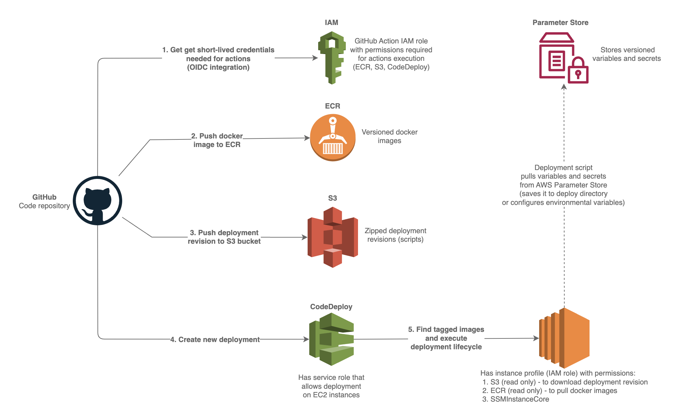

# About

This repository demnostrates deployment of a simple Node.js application to EC2 instance(s) using GitHub Actions and AWS CodeDeploy.

The diagram below shows the deployment process.




# Setup AWS

## Configure AWS credentials for GitHub Actions

There are several ways for fetching credentials from AWS, but it is recommend that you use GitHub's OIDC provider in conjunction with a configured AWS IAM Identity Provider endpoint.
    
1. Add an Identity Provider in AWS IAM. See official [AWS documentation](https://docs.aws.amazon.com/IAM/latest/UserGuide/id_roles_providers_create_oidc.html), [GitHub documentation](https://docs.github.com/en/actions/deployment/security-hardening-your-deployments/configuring-openid-connect-in-amazon-web-services) defining the provider URL and audience, and [configure-aws-credentials action documentation](https://github.com/marketplace/actions/configure-aws-credentials-for-github-actions) for thumbprints and CloudFormation template.

2. Create a IAM role that will be assumed by GitHub actions and configure trust policy. See [AWS documentation](https://docs.aws.amazon.com/IAM/latest/UserGuide/id_roles_create_for-idp_oidc.html) for more information (specifically GitHub section).

    *Remember to harden trust policy per GitHub documentation linked below so that the created role can only be assumed by GitHub Actions for the specific GitHub repository. This is done by adding condition to trust policy:*
    ```json
    "Condition": {
        "StringLike": {
            "token.actions.githubusercontent.com:aud": "sts.amazonaws.com",
            "token.actions.githubusercontent.com:sub": "repo:<your-org>/<your-repo-name>:*"
        }
    }
    ``` 

3. The role created in the previous step will be assumed by GitHub Action workflow. In order to execute specific actions the role needs to have required permissions. Add the permission policy to the creaded role for:

    3.1. **ECR** - for action to be able to push the image to ECR repository. See [amazon-ecr-login action documentation](https://github.com/marketplace/actions/amazon-ecr-login-action-for-github-actions)

    3.2. **S3** - for action to be able to push the deployment revision to S3 bucket

    3.3. **CodeDeploy** - for action to be able to create deployment in CodeDeploy

## Create ECR repository

Create ECR repository for storing the Docker image. See [AWS documentation](https://docs.aws.amazon.com/AmazonECR/latest/userguide/repository-create.html) for more information.

## Create S3 bucket

Create S3 bucket for storing the deployment revision. See [AWS documentation](https://docs.aws.amazon.com/AmazonS3/latest/userguide/create-bucket-overview.html) for more information.

## Create an instance profile (IAM role) for EC2 instances

Create an IAM role that will be added to EC2 instances. See official [AWS documentation](https://docs.aws.amazon.com/IAM/latest/UserGuide/id_roles_use_switch-role-ec2.html).

Add policies to the created role for:

1. ECR - to be able to pull the Docker image from private ECR repository

2. S3 - to be able to download the deployment revision from S3 bucket

3. SSM - to be able to execute commands on EC2 instance using SSM (AWS Systems Manager) (e.g. connect to instance, install CodeDeploy agent, etc.)

## Create EC2 instance(s)

Create EC2 instance(s) and add the created instance profile (IAM role) to the instance(s). See official [AWS documentation](https://docs.aws.amazon.com/AWSEC2/latest/UserGuide/iam-roles-for-amazon-ec2.html#attach-iam-role) for more information.

In our example the the instance requires docker and docker-compose to be installed. You can install that via SSM or you can use the following [user data](https://docs.aws.amazon.com/AWSEC2/latest/UserGuide/user-data.html) script to install the required packages:
```
#!/bin/bash
# Update installed packages
yum update -y

# Install Docker
yum install -y docker
service docker start
usermod -a -G docker ec2-user
chkconfig docker on

# Install Docker Compose
curl -L "https://github.com/docker/compose/releases/latest/download/docker-compose-$(uname -s)-$(uname -m)" -o /usr/local/bin/docker-compose
chmod +x /usr/local/bin/docker-compose

# Verify Docker and Docker Compose installation
docker --version
docker-compose --version
```

Tag the created instances with tag that will be later used by CodeDeploy deployment group to select the instances. See [AWS documentation](https://docs.aws.amazon.com/codedeploy/latest/userguide/instances-ec2-create-tag.html) for more information.

## Create CodeDeploy IAM service role

Create IAM service role for CodeDeploy. See [AWS documentation](https://docs.aws.amazon.com/codedeploy/latest/userguide/getting-started-create-service-role.html) for more information.

This roles allows CodeDeploy to access other AWS services (e.g. EC2, S3, ECR, etc.). When creating the role select the AWS service "CodeDeploy" and necessary policies will be added automatically.

## Create CodeDeploy application

1. Create code deploy application in CodeDeploy. Give the appliction a name and select the compute platform "EC2". See [AWS documentation](https://docs.aws.amazon.com/codedeploy/latest/userguide/getting-started-create-application.html) for more information.

2. Create deployment group for the created application. Give the deployment group a name, select the role created in previous step, select EC2 instances in the "Environment configuration" section, and select the tag created in previous step in the "Instance tags" section. See [AWS documentation](https://docs.aws.amazon.com/codedeploy/latest/userguide/deployment-groups-create.html) for more information.